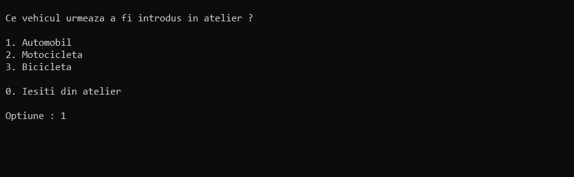
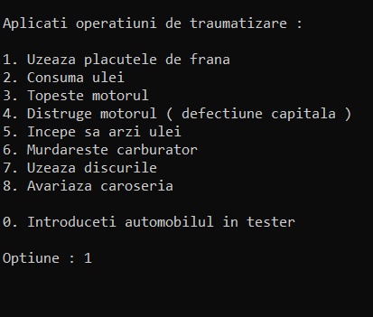
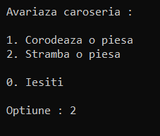
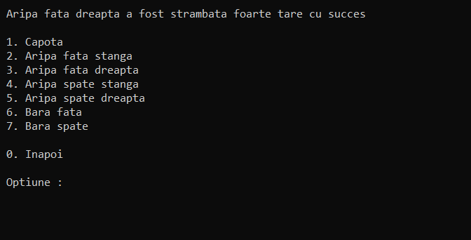
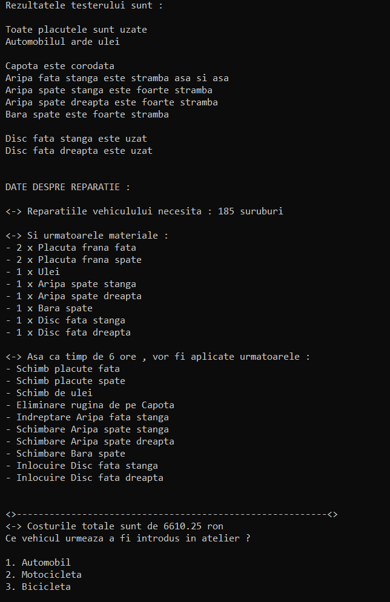

# Atelier-Auto (RO) / Auto Service (ENG)

## Cerință (RO)

### Precizări generale 

    1.	Puteți folosi STL si ce considerați ca e nevoie însă pentru temele care presupun structuri de date, 
        folosirea STL pentru exact structura de date din cerință ar evita scopul temei.
        
    2.	Cele mai multe cerințe sunt parțiale, lăsând la latitudinea voastră cum alegeți
        anumite elemente concrete pentru a ilustra cat mai bine competentele voastre de OOP.
        
    3.	In cazul in care o cerință este neclara si nu reușiți sa o clarificați singuri, 
        spuneți pe grup, sau discutam la laborator
        
    4.	1p in plus pentru folosirea de templateuri
    
    5.	1p in plus pentru un design pattern implementat
    
    6.	Încercați sa utilizați cat mai multe cunoștințe de POO pe care le-ați dobândit până acum și încercați
        sa implementați totul cum trebuie (cu constructori de copiere, operator=, alocare dinamica, fără memory leakuri, etc)
        
 ### Temă - Atelier auto: 

   Există mai multe categorii de vehicule (motocicletă, bicicletă, automobil) care pot sosi la un garaj pentru a descoperi ce probleme tehnice au si a obține un deviz de reparații. Fiecare vehicul poate avea probleme din diferite categorii: frâne, direcție, noxe, motor, caroserie. Nu toate vehiculele pot avea toate tipurile de probleme. Fiecare tip de problema are o soluție tehnica ce presupune un anumit consum de materiale (de diferite tipuri) si un anumit efort uman (in ore-om). Fiecare material are un cost la fel ca si ora-om de efort uman. Pentru fiecare vehicul ce sosește in garaj trebuie calculat devizul estimativ.
   
      
### Precizări: 

    1.	Tipurile de probleme vor include cel puțin: 
        Frâne – plăcuțe uzate (față/spate la un auto/moto), discuri uzate (oricare din 4 la un auto, oricare din 2 la moto), 
            lanț tocit (bicicletă), lanț lipsă (bicicletă), 
        Motor  - Nivel ulei scăzut (la moto si auto),carburator murdar (la auto), motor topit (la moto si auto); 
        Direcție – ghidon strâmb (bicicleta, moto), roată strâmba (toate), defecțiune capitala (toate); 
        Noxe – Vehiculul arde ulei (moto si auto), Vehiculul este anterior anului 2000 (moto si auto);
        Caroserie (auto) – Caroserie corodata de rugina, Caroserie strâmba (aripi stânga/dreapta, fată/spate, bară, capotă)
            foarte strâmbă sau așa-și-așa (pe fiecare componentă in parte).

    2.	Soluțiile presupun un consum de materiale. Materialele sunt toate la bucată. 
        Plăcuțele de frână de pe spate diferă de cele de pe față. 
        Plăcutele de frână sunt aferente fiecărei roti. 
        Nivel ulei scăzut, motor topit si vehiculul arde ulei toate presupun schimb de ulei.

    3.	Fiecare problemă are o soluție (mai puțin defecțiunea capitală). 
        Pot exista tipuri de materiale comune mai multor soluții. 
        Toate soluțiile consuma șuruburi (minim 5). 

    4.	Vehiculul suportă operațiuni de traumatizare (e.g. Uzează discul de frână de pe spate dreapta sau Începe sa arzi ulei).

    5.	Vehiculul odată conectat la tester (in atelier) se va putea autodiagnostica verificând fiecare componenta a sa si returnând lista de probleme.
        
## Requirement (ENG)

### General details (regardless of the chosen theme)

    1.	You can use STL, but for themes that invole data structures using STL for exactly the data 
        structure in the requirement would avoid the purpose of the theme.
        
    2.	Most of the requirements are partial, it is the student's job to decide and apply different 
        OOP concepts to solve the problem.
        
    3.	In the case of a requirement that is unclear, announce it on the group or we can disscuss at lab.
        
    4.	Plus 1p for templates usage.
    
    5.	Plus 1p for the implementation of a design pattern.
    
    6.	Try to use as many OOP techniques learned during this class and to implement everything in a
    	clean and correct manner (copy constructors, = operator, dynamic allocation, no memory leaks, etc...)
    
 ### Theme - Auto Service: 

   There are multiple vehicle categories (bike, motorcycle, car) that can pull up to the service to discover and repair multiple (possible) technical problems. Every type of 
vehicle can have multiple failures such as: brakes, direction, emissions, engine, body panels, etc.. . The possible failures differ in function of the vehicle type. Every failure has a technical solution that involves a certain raw material usage (different types) and a certain human effort (hours/man). Every material has a price as well as the human effort. After the inspection of the vehicle an estimate of the reppair price should be calculated. 
   
### Remarks: 

    1.	Failure types will include at least:
        Brakes - Worn brake pads (front/back - car/motorcycle), worn brake disks (any of the 4 at a car, any of the 2 at a motorcycle),
            blunt chain and/or missing chain (bike);
        Engine - Low oil (car/motorcycle), dirty carburettor (car), melted engine (car/motorcycle);
        Steering - Croocked handlebar (bike/motorcycle), croocked wheel (any), total defection (any); 
        Emissions - The vehicle is burning oil (car/motorcycle), Vehicle is older than 2000 (car/motorcycle)
        Body panels (Only car) - rusted bodywork, crooked bodywork (all body panels with multiple levels of affection.
    
    2.	The solutions involve a material consumption. Every material is to-piece.
        Front brake disks differ from the back ones.	
        Every brake disk is related to it's own wheel.
        Low oil level, melted engine and vehicle burning oil need oil change.

    3.	Every problem has a fix (except total defection)
        There can be common material types between different fixes.
        Every solution uses screws (at least 5).
       
    4.	The vehicle supports damaging operations (e.g. wear right-front brake disk or start burning oil).

    5.	Once connected to the tester (in the service) the vehicle will be checked and a list of problems will be returned to the user.

## Prezentare (RO) - Presentation (ENG):

 (RO) Pentru exemplu vom alege in meniul principal un Automobil din clasa A ( de lux ).
 (ENG) For the showcase example we're going to choose a vehicle from type A (luxury) from the main menu.
    
 
    
 (RO) Ne sunt disponibile urmatoarele operatiuni de traumatizare:
 (ENG) There are multiple damage operations available: 
    
 
    
 (RO) A se puncta ca unele operatiuni au rezultatul ales aleator cum ar fi: alegerea placuțelor care se uzează sau cât de tare se stramba o piesa din caroserie.
    
 (RO) Pentru exemplul nostru am uzat placutele de frână , consumat uleiul , uzat discurile de pe fata. 
 De asemenea am avariat automobilul prin corodarea capotei si lovirea mai multor părți din caroserie:
 
 (ENG) To score as some operations have a random outcome such as: choosing which brake plate to wear (first option from above picture) or how hard to crook a body part (option 8 from above picture)
 
 (ENG) For our example we wore brake plates and fron disk brakes (first option from above picture), consumed the oil (second option from above picture). 
 Also the bodykit was damaged by hood corrosion and hitting other body panels (In the 2 images below is presented the bodykit damage menu and submenu). 
        
 
 
    
 (RO) După introducerea autovehiculului la tester obținem următoarele rezultate:
 
 (ENG) After introducing the vehicle to the tester we obtain the following results:
    
 
    
 (RO) Unde ne sunt furnizate:
    
    1. Problemele depistate
    2. Materialele necesare reparatiei: fiecare procedura necesita un anumit numar de suruburi,
    unele necesita materiale.
    3. Procedurile de reparare a vehiculului si numarul de ore necesar aplicarii lor.
    4. Costurile totale. In cazul de fata , pentru un automobil de lux a fost folosită următoarea
    formulă: Total = costuri * (2.15) + ore_muncă * (50) 
 
 (RO) A se nota: 
   
    Valoarea costuri este calculata pe baza prețului inițial al fiecarei piese înmulțită cu o pondere (diferită în funcție de tipul vehiculului).
    Orele de muncă sunt calculate pe baza procedurilor aplicate si înmulțite cu preț/h (de asemenea și prețul mâinii de lucru diferă în funcție de tipul vechiculului).     
    
 (ENG) Where we are provided with:
    
    1. Problems detected.
    2. Necessary materials for reparation: every fix require a certain amount of screws and some even require special materials.
    3. Fixing procedures of the vehicle and the time needed to apply them.
    4. Total costs. In this case, for a luxury car the following formula was used: Total = Costs * (2.15) + Work time * (50)
 
 (ENG) To score: 
   
    Material cost value is calculated based on initial price of every piece multiplied by a wight (specific to the vehicle type).
    Cost of the working hours is calculated based on the applied fixing procedures multiplied by price/h (also specific to the vehicle type).
    
## Îmbunătățiri posibile (RO):

  1. Adăugarea unei interfețe grafice.
  
  2. Creșterea complexității (exemple):
  
         * Să se ia în calcul firma si modelul vehiculului. ( Piesele devin aferente pe model; eg: Disc spate Mercedes AMG GT)
         * Să se țină o evidență a pieselor în depozitul atelierului (disponibile sau nu); -> implică adăugarea unui meniu pentru inserarea pieselor în depozit/stoc.
         * Adaugarea a noi probleme posibile (si procedurile de reparație aferente , eg: Bujie stricată , Tobă spartă ... )

## Possible improvements (ENG):

  1. Adding GUI.
  
  2. Incresing complexity (e.g.):
  
         * The mark and the model of the vehicle to be taken into account. (The parts become afferent to the vehicle e.g: Mercedes AMG GT rear brake disk).
         * Keep a record of the parts in the shop (available or not); -> Involve adding a menu where the usser can add pieces in stock.
         * Adding new problems (and related fixes, e.g: Broken exhaust, broken spark plug, etc...).
     
